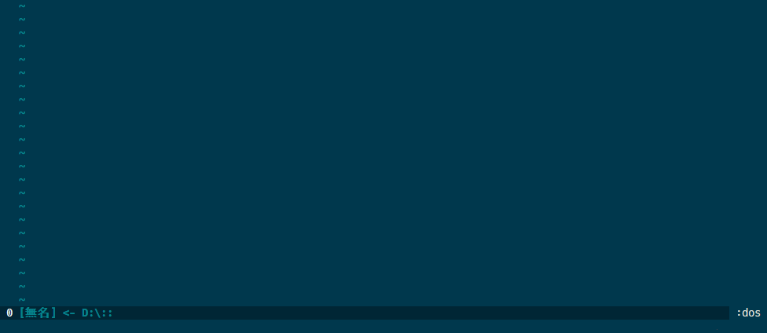

vim-win32-installer-release
===========================

Download latest vim-win32-installer release via Vim script

Demo
----



Requirement
-----------

* vim 8.0 or later (+terminal, +job)
* curl

Usage
-----

```vim
:Win32InstallerLatest
```

### `g:win32installer_autostart` (default: `0`)

Set this to 1 start downloader after loading the plugin

```vim
let g:win32installer_autostart = 1
```

It is useful to locate the plugin to the `opt` folder in `packdir` and use `packadd vim-win32-installer`.

### `g:win32installer_curl_options` (default: `[]`)

Pass the option to the `curl` command as paramters

```vim
let g:win32installer_curl_options = ['--insecure']
```

Install
-------

- Install this plugin with your favorite plugin manager
- Use "Vim packages"
  1. Locate this plugin to the `~/.vim/pack/downloader/opt/vim-win32-installer`
  2. `:packadd vim-win32-installer`

License
-------

MIT License

Author
------

sgur
